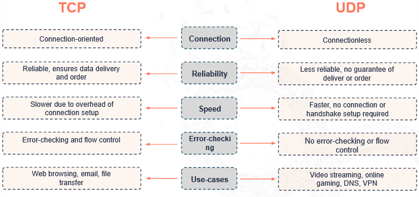
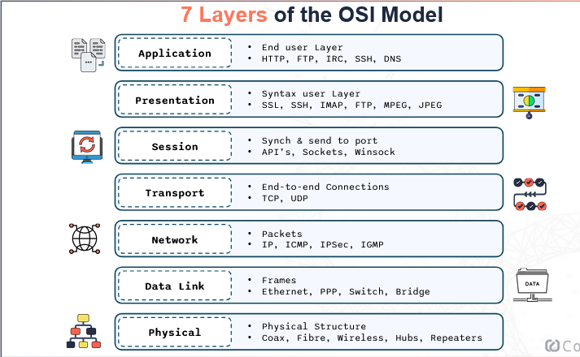
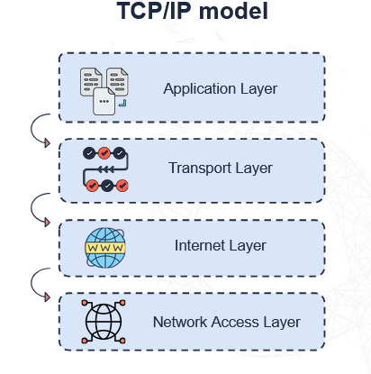
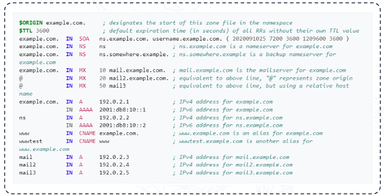
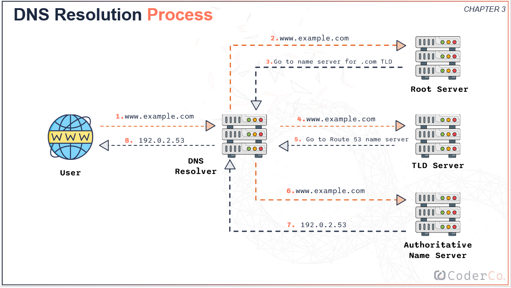
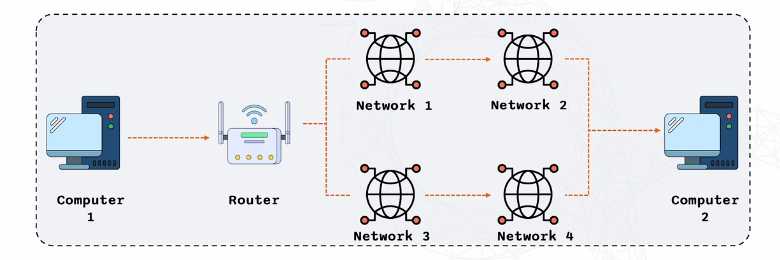

# Table of Contents <!-- omit in toc -->

- [1. Introduction to Networking](#1-introduction-to-networking)
  - [Overview of Computer Networks](#overview-of-computer-networks)
    - [What is the importance of Networking](#what-is-the-importance-of-networking)
    - [Networking in DevOps](#networking-in-devops)
  - [Components](#components)
    - [Switches](#switches)
    - [Routers](#routers)
    - [Firewalls](#firewalls)
  - [IP address \& MAC address](#ip-address--mac-address)
    - [IP addressing (IPv4/IPv6)](#ip-addressing-ipv4ipv6)
    - [IPv4](#ipv4)
    - [IPv6](#ipv6)
    - [MAC Address](#mac-address)
  - [Ports \& Protocols: TCP, UDP](#ports--protocols-tcp-udp)
    - [Transmission Control Protocol (TCP)](#transmission-control-protocol-tcp)
    - [User Datagram Protocol UDP](#user-datagram-protocol-udp)
    - [Characteristics of UDP](#characteristics-of-udp)
    - [TCP vs UDP](#tcp-vs-udp)
- [2. OSI MODEL (Open Systems Interconncetion)](#2-osi-model-open-systems-interconncetion)
  - [Why do we need a communication model?](#why-do-we-need-a-communication-model)
  - [The 7 Layers of the OSI Model](#the-7-layers-of-the-osi-model)
    - [Layer 1: Physical Layer](#layer-1-physical-layer)
    - [Layer 2: Data Layer](#layer-2-data-layer)
    - [Layer 3: Network Layer](#layer-3-network-layer)
    - [Layer 4: Transport Layer](#layer-4-transport-layer)
    - [Layer 5: Session Layer](#layer-5-session-layer)
    - [Layer 6: Presentation Layer](#layer-6-presentation-layer)
    - [Layer 7: Application Layer](#layer-7-application-layer)
  - [TCP/IP Model: A Commonly Used Model](#tcpip-model-a-commonly-used-model)
    - [Application Layer](#application-layer)
    - [Transport Layer](#transport-layer)
    - [Internet Layer](#internet-layer)
    - [Network Access Layer](#network-access-layer)
  - [OSI layers: POV of Sender \& Receiver](#osi-layers-pov-of-sender--receiver)
    - [Sender POV:](#sender-pov)
    - [Reciever POV:](#reciever-pov)
- [3. DNS (Domain Name System)](#3-dns-domain-name-system)
  - [What is DNS?](#what-is-dns)
  - [DNS Components](#dns-components)
    - [Name Servers](#name-servers)
    - [Zone files](#zone-files)
    - [Records](#records)
  - [DNS Records](#dns-records)
  - [DNS Process](#dns-process)
    - [Intro to DNS resolution](#intro-to-dns-resolution)
    - [DNS Hierachy and Distribution](#dns-hierachy-and-distribution)
    - [DNS Resolution Process](#dns-resolution-process)
    - [Importance of DNS Resolution for DevOps Engineer](#importance-of-dns-resolution-for-devops-engineer)
  - [Domain Registrar vs DNS Hosting Provider](#domain-registrar-vs-dns-hosting-provider)
  - [DNS tools](#dns-tools)
      - [nslookup](#nslookup)
      - [dig](#dig)
  - [/etc/hosts File](#etchosts-file)
    - [editing /etc/hosts](#editing-etchosts)
- [4. Routing](#4-routing)
    - [What is routing?](#what-is-routing)
    - [How Routing works?](#how-routing-works)
    - [Why routing matters for Devops?](#why-routing-matters-for-devops)
  - [Static vs Dynamic Routing](#static-vs-dynamic-routing)
    - [Static](#static)
    - [Dynamic](#dynamic)
  - [Common Routing Protocols](#common-routing-protocols)
    - [OSPF (Open Shortest Path First)](#ospf-open-shortest-path-first)
    - [BGP (Border Gateway Protocol)](#bgp-border-gateway-protocol)
- [5. Subnetting](#5-subnetting)
  - [What is subnetting?](#what-is-subnetting)
    - [Understanding CIDR Notations](#understanding-cidr-notations)
  - [NAT (Network Address Translation)](#nat-network-address-translation)
    - [NAT process](#nat-process)
    - [Types of NAT](#types-of-nat)
    - [Benefits of Nat for DevOps Engineers](#benefits-of-nat-for-devops-engineers)
- [6. Troubleshooting](#6-troubleshooting)
  - [Common Network Problems](#common-network-problems)
  - [Useful tools](#useful-tools)


# 1. Introduction to Networking

## Overview of Computer Networks

A Computer Network is group of devices that are connected to each other, allowing them to share information and resources.

In this module we will be focusing on two core types of networks:

- **LAN** (Local Area Network). This is used to connect devices over a small area like a home or office.
- **WAN** (Wide Area Network), this is used to connect multiple LAN's over a large area, like a city, country or larger region.

### What is the importance of Networking

1. **Foundation** — Enables communication between devices.
2. **Resouce Sharing:** — Facilitates sharing of files, printers and more.
3. **Internet Functionality:** — Critical for browsing, streaming and communication.
4. **Application Support:** — Backbone for app connectivity and data transfer.

### Networking in DevOps

Networking is used in Devops for:
1. **Sever Interaction** — Enables communication between servers and applications.
2. **Deployment** — Critical for launching and updating applications.
3. **Managment** — Crucial in monitoring and managing infrastructure.
4. **Optimisation** — Enhances troubleshooting, performance and scalability.


## Components

### Switches
- Connect Devices within the same network.
- Mangae data flow within a LAN.

### Routers
- Direct traffic between networks.
- Connect different networks.

### Firewalls
- Protect networks from unauthorised access.
- Monitor and control incoming & outgoing network traffic.


## IP address & MAC address

### IP addressing (IPv4/IPv6)

An IP address (Internet Protocol address) is a unique identifier for each device on a network. there are two types of IP addresses, IPv4 and IPv6. IP are important as they enable devices to identify and communicate with each other on a network, without these a device wouldn't know where to send or receive data.

### IPv4

This is the most common type of IP address. They follow the format shown below. Each number can range from 0 to 255. Providing 4.3 billion addresses.
```                             
                                IPV4
---------------------------------------------------------------------

                             192.168.0.5
                            32-bit address
            Format: four decimal numbers seperated by dots
```

### IPv6

With the rapid growth of the internet, IPv4 addresses are becoming scarce — that's where IPv6 comes in. IPv6 not only provides more addresses but also includes enhancement like simplified address assignment and improved security features.
```                             
                                IPV6
---------------------------------------------------------------------

                2001:0db8:85a3:0000:0000:8a2e:0370:7334
                            128-bit address
 Format: eight groups of four hexadecimal digits seperated by colons
```
### MAC Address

MAC (Media access control address), think of it as a fingerprint, each device in a netowrk has its own MAC address. These are unique identifiers assinged to network interfaces, they are essential for network communcation and security.

- MAC addresses operate at the data link layer
- Facilates device identification within a local network

```                             
                                MAC
---------------------------------------------------------------------

                     Example: 00:1A:2B:3C:4D:5E
                            48-bit address
 Format: six groups of two hexadecimal digits seperated by colons
```


## Ports & Protocols: TCP, UDP

**Ports** —  These are logical endpoints for communication

**Protocols**  —  Rules governing data transmission

Ports and protocols facilates communication between devices.

---
### Transmission Control Protocol (TCP)
TCP is a fundamental protocal in the array of internet protocols. It ensure data sent from one devices reaches another device accurately and in the correct order. It is a protocol, therefore TCP is a set of rules that allow devices to communicate with each other.

### Characteristics of TCP <!-- omit in toc -->
- **Connection-orientated:** Before any data is sent, a connection between the two devices must be established, think of it as a phone call — you need to dial and connect before you can talk.
- **Requires 'handshake':** This is a process where the two devices agree to communicate, in networking, this is a 3-step process to ensure both devices are ready to send and receive data.
- **Reliable data transfer:** TCP enure all data sent is received correctly on the other end. If any data is lost or corrupted, TCP will resend it.

**Function:**
- Ensures data is delivered in order
- Error-checking and flow control
- Any bidirectional communications
  
---
### User Datagram Protocol UDP

Unlike TCP, UDP doesn't require a connection to be established.

### Characteristics of UDP
- **Simple protocol to send and receive data:** UDP is straight-foward and doesn't require much overhead, making it quick and easy.
- **Prior communication not required (can be a double-edged sword):** Data can be sent immediatley without waiting to establish connection, however there is no guarantee the data will reach it's destination.
- **Connectionless:** No form of connection established between sender and receiver, each packet is sent independantly.
- **Fast but less reliable:** Since there's no connection set up and less error checking, UDP is much faster than TCP, but this speed comes at a cost of reliability.

**Functions:**
- Suitable for real-time applications (e.g. video streaming)
- DNS
- VPN

---
### TCP vs UDP




# 2. OSI MODEL (Open Systems Interconncetion)

## Why do we need a communication model?

A communication model provides a standard framework that simplififes the way devices and applications communicate within a network. These models ensures all devices can understand each other.

1. **Application Independance**
       - Without a standard model, applications must understand the underlying network
       - You would need to have different versions of your application/software for WI-FI, Ethernet, Fiber etc.

2. **Simplified Network Equipment Management**
       - Upgrading network equipment is difficult without a standard model

3. **Decoupled innovation**
       - Innovations can happen in each layer independantly. without affecting the entire system


## The 7 Layers of the OSI Model



---
### Layer 1: Physical Layer

**Function:** Transmits raw bit stream over a physical medium e.g. Fibre, Wireless, Hubs, Repeaters, etc.

**Components**: Cables, switches and network interface cards.

At this layer there is no device addressing, all data is processed by all devices, an anoalogy of this is shouting in a room and not using names. This is a limitation solved by layer 2.

---
### Layer 2: Data Layer

**Function:** This layer provides node-to-node data transfer and detects, possibly corrects, errors that may occur in Physical layer. It ensures that data is transferred correctly between adjacent network nodes.

At layer 1 This layer puts data packets into frames 

**Components**: MAC Addresses, Switches and Bridges.

This layer is all about maintaining a reliable link between different devices. At layer 1, everything is unordered and sent randomly, the data layer put your packets into frames, where it is actually organised. 

Frames can be thought of as envelopes, they carry the data and ensures it gets to the right place.

---
### Layer 3: Network Layer

**Function:** Determines how data is sent to the recipient

Manages packet forwarding including routing through intermediate routers

**Components**: IP addresses, Routers

These devices direct data packets along the best path across networks.

---
### Layer 4: Transport Layer

**Function:** Provides reliable data transfer services to the upper layers, Segments and reassembles data.

**Components**: TCP, UDP

TCP sends reliable, ordered and error-free data, almost like getting a certification and confirmation when a letter is received. UDP is much faster but less reliable.

---
### Layer 5: Session Layer

**Function:** Manages sessions between application.

Establishes, maintains, and terminates connections.

**Components**: Session managment protocols

---
### Layer 6: Presentation Layer

**Function:** Translates data between the application layer and the network. Ensures that data is in a usable format.

**Components**: Encrytion, data formatting

Also known as Syntax user layer. This is where SSL, SSH, IMAP, FTP, MPEG, JPEG can be found.

---
### Layer 7: Application Layer

**Function:** Provides network services directly to application. This is the End-user layer

**Components**: HTTP, FTP, SMTP


## TCP/IP Model: A Commonly Used Model

This is a condensed version of the OSI Model.



---
### Application Layer

This is the top layer where user interacts with network applications , HTTP, TLP, DNS. It handles data formatting and encrytption.

This condenses layer 5 (session), 6 (Presentation) and 7 (Application).

---
### Transport Layer

This layer is where end-to-end communication and data transfer between devices happens. TCP, UDP. Again, the same as OSI.

This is the same as the OSI model

---
### Internet Layer

This layer is responsible for logical addressing and routing data to different servers. The primary protocol for this is IP. IP handles the delivery of packets from the source to the destination, through multiple networks.

This is the same as the Network Layer in the OSI model

----
### Network Access Layer

This is the bottom layer. Handles the physical hardware, cabling, and locla MAC addressing (Ethernet, Wi-Fi).

This encompases Layer 1 (Physical) and 2 (Data).

----


## OSI layers: POV of Sender & Receiver


### Sender POV:
>                                        USER sends a POST request to an HTTP web page
> ---
>                 Layer 7 - Application:      Developer pulls latest main or clones repo
>                         ↓
>                 Layer 6 - Presentation:     Serialise JSON to flat byte data strings
>                         ↓
>                 Layer 5 - Session:          Request to establish TCP connection/TLS
>                         ↓
>                 Layer 4 - Transport:        Sends SYN request to target port 443 which is HTTPS
>                         ↓
>                 Layer 3 - Network:          SYN in an IP packet(s) and adds the source/destination IP
>                         ↓
>                 Layer 2 - Data:             Each Packet goes into a single frame and add the source/destination MAC addresses
>                         ↓
>                 Layer 1 - Physical:         Each frame becomes a string of bits which is converted into either a radio signal (Wi-Fi), electrical signal (Ethernet), or light (Fibre)

### Reciever POV:
>                                        USER sends a POST request to an HTTP web page
> ---
>                 Layer 1 - Physical:         Radio, electric or light is received and converted into digital bits
>                         ↓
>                 Layer 2 - Data:             The bits from layer 1 is assembled into frame
>                         ↓
>                 Layer 3 - Network:          The frame from layer2 are assembled into an IP packet
>                         ↓
>                 Layer 4 - Transport:        The IP packetes from layer 3 are assembled into TCP segments
>                         ↓
>                 Layer 5 - Session:          The connection session is established
>                         ↓
>                 Layer 6 - Presentaion :     Decrypt and decompresses this data received
>                         ↓
>                 Layer 7 - Application:      The data is then sent to the appropiat application for the recipient to recieve


# 3. DNS (Domain Name System)

## What is DNS?

Low-level networking only understands the raw IP address to identify a host or machine. DNS (Domain Name System) allows humans to keep track of websites by name instead of an IP address. Essentialy DNS acts like a phone book for websites. In short DNS is the translation of domain names to IP addreses.

Role in netwokring:
- Simplifies navigation on the internet
- Essential for accessing websites and services

## DNS Components

### Name Servers

Name Servers load DNS settings and also respond queries from servers or clients about domain name.

There are two types:
- Authoratative Name Servers — These hold the actual DNS record. When queried, they provide the definitve answer about DNS.
- Recursive Name Servers — These do not hold the actual DNS record. When queried, they query other name servers on behalf of clients to find the actual DNS record. Recursive servers can also cache the information they recieve to speed up future queries.


> Try: dig ns google.com


### Zone files

Zone files are stored inside Name Servers and they contain the information about the domain. They help name severs answer queries about how to reach a domain if the name server doesn't know the answer directly.

They store the information in an organised and readable format.

This is an example.



### Records

Records or 'Resource Records', a Zone File is comprised of multiple resource records. Each record contains specific information about Hosts, Name Servers and various other resources. Some components or Resource Records are: Record name, TTL, Class, Type, Data.

|Resource Records|Descriptions|
|:--------------:|:----------|
|Record Name| The domain name being queried|
|Time to live (TTL)| Indicates how long the record is valid (before refresh requred)|
|Class| Namespace of the record information|
|Type |Type of record (A or MX or AAA etc.)|
|NS| Name server Record|
|Data| The actual information corresponding to the record type. Like IP address for an A record|


## DNS Records

|Records|Descriptions|Example|
|:-:|:-|:-|
|A| Maps a domain name to an IPv4 address| google.com → 216.58.204.79| 
|AAAA| Maps a domain name to an IPv6 address| google.com → 2a00:1450:4009:81d::200e|
|CNAME| Alias of one name to another. It allows you to point multiple domain names to the same IP address| www.google.com → google.com|
|MX |Specifies the mall server responsible for receiving email for the domain. Includes priority values| google.com → mailserver.google.com|
|TXT| Allows domain adminstrator to insert any text into DNS. Commonly used for verification purposes and to hold SPF (Sender Police Framework) data| google.com → "v=spf1 include.com ~all"|


## DNS Process

### Intro to DNS resolution

DNS resolution is the process of converting domain names into IP addresses. This is a detailed process and I will be breaking down the steps in this section.

### DNS Hierachy and Distribution

> DNS ROOT > Top Level Domains (TLD) > Authoratative Name Servers + Zones for domains > Domain


1. The `DNS Root` is the top of the hierachy, it doesnt store specific details about domains but rather it keeps high-level information to find the Top Level Domains' (TLD's) under neath it. 
2. The next level in the hierach is the TLD, they include familiar extension like **.com**, **.org**, **.net**, for instance the registry for **.com** is managed by Verisign. Each TLD stores information about domains within their scope.
3. Moving down another level, Authoratative Name Servers. Each server hosts zones for domains, meaning they have the detailed DNS records for those domains.
4. Finally we have the domains themselves, for example **google.com**, each domain has a zone (specific slice of Namespace ) and zone files which is a detailed list of records associated with the domain, like IP addresses, Mail Servers are stored.

### DNS Resolution Process

Now you've typed in Google.com into a browser. What happens as a user? 




1. You type in Google.com into your browser. Your browser sends a request to a DNS resolver that is local to you. 
2. The DNS resolver does a query. It receives the request and starts looking for the IP address. First, it checks its local cache to see if it knows the IP address. If not, it moves to the next step. 
3. The resolver then queries a root server for the IP address. Now, the root server doesn't yet know the IP address of the domain, but knows where to find the .com top-level domain server. 
4. Then you have the TLD server. The resolver then queries a .com TLD server. The TLD server doesn't know the exact IP address of Google.com either, but it knows which authoritative name server to ask.
5. The DNS Resolver receives information about the authoratative name server. 
6. Then finally, the resolver queries the authoritative name server for Google.com. This server has the definitive IP address. 
7. Then the IP address is returned to your DNS resolver with IP address '192.0.2.53'.
8. The DNS resolver sends the IP address back to your browser. Now that your browser has the IP address, it can connect to a web server at '192.0.2.53' and then your website, Google.com, loads.

### Importance of DNS Resolution for DevOps Engineer

- Important to learn DNS Resolution to ensure service availability. 
- Understanding how it works will help with debugging dns issues.
- Critical for configuring and managaing network services. For example stting up VPC's.

## Domain Registrar vs DNS Hosting Provider

|Domain Registrar|DNS Hosting Provider|
|----------------|--------------------|
|This entity allows you to purchase and register domain|Operates DNS Nameservers|
|The registrar communicates with the TLD registry to manage domain registrations|They host zones on the servers and allow you to mainain record in these zones|
|Examples include godaddy, cloudflare etc.| Examples include Route53hostingzone and more|

When you purchase a domain, you need the domain zone to be hosted on a DNS Name Server. The process varies depending on whether the DNS Hosting Provider is the same as the domain register. There are two cases:
- If the domain registrar and the DNS hosting provider are the same company, the DNS Zone is automatically created and hosted on purchase of the domain.
- If they are different companies, for example you buy a domain on cloud flare and domain hosted zone on AWS, in this case you need to provide the domain server information on where the DNS zone is hosted. This information is configured seperately.

## DNS tools

There are two main tools for debugging DNS issues: nslookup and dig

#### nslookup 

`nslookup` is a basic and widely used tool for querying DNS servers. When you use this command you can find information about DNS records for certain domains. The syntax for it is `nslookup [domain]`.

#### dig

`dig` sants for domain information gropper. It is an advanced DNS query tool, giving much more detail than `nslookup`. The syntax for this command is `dig [domain]`.

## /etc/hosts File

`/etc/hosts` is a local file on your computer, that maps domain names to IP addresses. It takes precedence over DNS for specific entries.

### editing /etc/hosts

Note: adimin privelleges are required to edit this file

1. Open file with text editior of your choice e.g. vim
2. Format: IP_address domain_name
3. Example: 127.0.0.1


# 4. Routing

### What is routing?

**Definition** : Routing is the process of determining the best paths for data to travel across networks

**Importance** :
- Ensure data reaches it's destination efficiently
- Fundamental for internet functionality

### How Routing works?

Routing Process:
- Routers determine the best path
- Use routing table to make decisions

Key Componenets:
- Routers
- Routing tables

Example process



Lets say for example we send a message or request, the data starts at computer 1. The first places it goes to is the router which checks its routing table which determines the best path to reach the destination. The router send the data to the first network on it's path. The data might hop through several servers until it reaches it's destination at computer 2.

### Why routing matters for Devops?

- Networking Perfomance optimisation
- Ensures reliable application delivery
- Crucial for managing complex infrastructures


## Static vs Dynamic Routing

### Static
- Routes are manually configured by network admins.
- It gaves data a fixed route to destination.
- It is reliable, but doesn't adapt well to changes, this makes it hard to scale.

### Dynamic
- Routes are determined by algorithms that automatically find the best route for data.
- Routes are automatically agjusted, keeps data routing smooth and efficiently even if network conditions change.
- It is very flexible and adaptable to changes, perfect for scaling.

## Common Routing Protocols

Routing protocols are essential as they automate the process of determining the best route for data to travel across a network, instead of manually setting up routes. The routing protocols also enhance network efficiency, as they ensure our packets always take the best path available - reducing congestion and improving the overall network performance.

The most common routing protocols are OSPF and BGP. These are very complex systems and we will only touch on these topics.

### OSPF (Open Shortest Path First)
- This protocol — like in the name — finds the shortest path for data to travel.
- Is mainly used my large organisations.
- OSPF uses Link State Information which is a complex system for making routing decisions. It considers the status of a network, the link and the cost to use them.
- Known for it's fast conversions, it can quickly recalculate paths when there are changes in the network.

### BGP (Border Gateway Protocol)
- This is also used to route data between different autonomus systems.
- Autonomus systems can be thought of as large networks managed by single organsisations.
- BGP uses a Path Vector Mechanism, maintains the path information that gets updated dynamically as the netowrk topology changes
- Allows network admins to define network policies based on various attributes. Providing greater control on how trafic flows through a network.

# 5. Subnetting

## What is subnetting?

- It involves dividing a network into smaller networks.
- Used to improve network management and efficiency.
- Exclusively used in Level 3 (Network layer)

### Understanding CIDR Notations

CIDR stands for Classless Inter-Domain Routing. It is a method for allocating IP addresses and routing IP packets.

```
Format:     IP_address/prefix_length
Example:    192.168.1.0/24 
                   ↓
            Represents the network 192.168.1.0/24 with a subnet mask of 24 bits or 255.255.255.0
```

The mask of a subnet determines which part of an IP address is the network and which part is the host potion.

```
      Subnet masks             # Where N represents network, and H represents host portion 
-------------------------
Class A:  255.0.0.0        >   Network: 8 bits    Host portion: 24 bits
         <---><----->
           N     H

Class B:  255.255.0.0      >   Network: 16 bits   Host portion: 16 bits  
         <-------><-->
             N     H

Class C:  255.255.255.0    >   Network: 24 bits   Host portion: 8 bits
         <----------><->
               N      H

```

## NAT (Network Address Translation)

NAT (Network Address Translation) converts private IP addresses to a public IP address. This facilitates communication between internal network and the internet. Without NAT each device would need it's own Public IP address to access the internet, which is not practical given that IPv4 addresses are running out.

### NAT process

- Internal devices use private IP addresses
- Router translates private IP to public IP
- Facilitates communication with external networks

### Types of NAT

Static NAT: Maps a single private IP to a single public IP. 1:1 mapping. This is useful when the IP needs to stay constant, for example a web server.

Dynamic NAT: Maps a single private IP to one of many Public IP's in a pool. When you need to access the internet your device will be assigned a public IP, once done the IP would go back to the pool of Public IP's for somewone else to use.

PAT (Port Address Translation): This is known as NAT Overload, it allows multiple devices on a local network to get mapped to a single Public IP, but on different ports. This is what most home routers use.

### Benefits of Nat for DevOps Engineers
- Conserves public IP addresses
- Enhances network security
- Simplifies network design and managment

# 6. Troubleshooting
- Ensure smmooth operations
- Identifying and fix network problems
- Minimise downtime

## Common Network Problems
- Connectivity loss
- Slow network performance
- IP address conflicts
- DNS resolution failures

## Useful tools

`ping` — used to test any connectivity betwwen devices. Usage: `ping [IP address or domain]`

`traceroute` — tracks the path the packets take to reach your target destination. Usage: `traceroute [domain]`

`Nslook` — used for querying DNS to find the IP address associated with a fomain. Usage: `nslookup [domain]`

