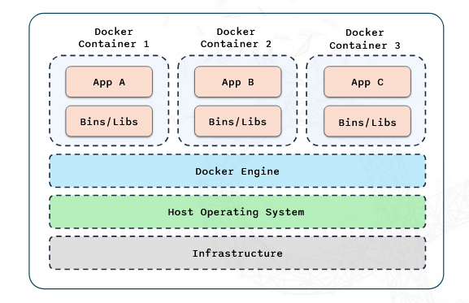
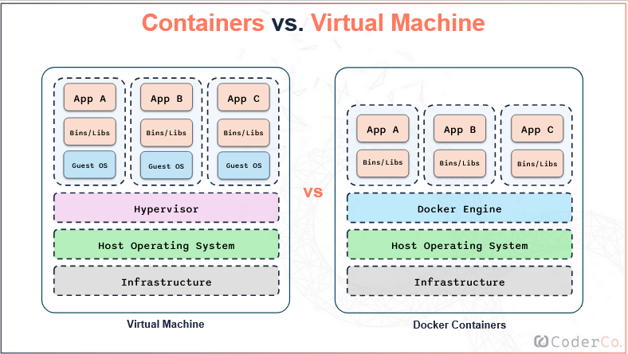
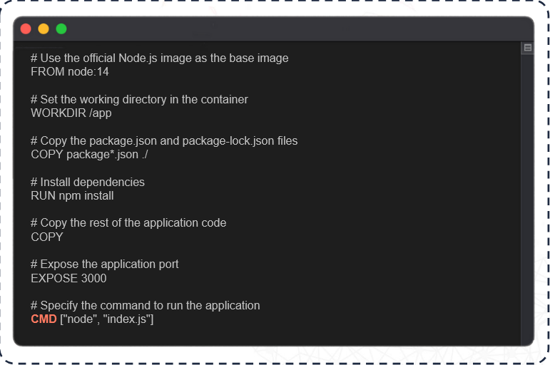

# 1. Introduction to Docker

## What are Containers?

Containers are lightweight portable units for running applications. They bundle an application with all of it's dependencies, ensuring it runs consistently across different environments.

In this diagram, we see three containers sitting on a Docker Engine. Each container has the app and the binaries and libraries that the app requires to run. And the docker engine sits inline with the Host operating system. This all sits above the infrastructure (the host machine).

Starting from the bottom of the diagram:

- **Infrastructure:** The infrastructure represents the physical or virtual hardware, where everthing runs.
- **Host Operating System:** This is the OS that run directly on the infrastructure.
- **Docker Engine:** The Docker Enigne is what makes containerisation possible. It provides the environment to build, run and manage containers.
- **Docker Containers:** Each container holds an application and all its dependencies. This isolation ensures that each app runs consistently, regardless of the environment. For example, because they are isolated, App A doesn't affect App B.

A good analogy is thinking of containers like shipping containers, just as shiping containers hold everthing needed for goods to be transported and can be easily moved from ships, docker containers hold everthing an app needs to run and can be easily moved from one environment to another.

Each container shares the underlying doecker engine, but what differs is the envrionment within the container itself. This makes them lightweight and efficient as they share the Docker Engine and Host Operating System, unlike virtual machines which takes a subset of an Operating System.

## Benefits of Containers

- Isolation — Ensures app run smoothly without interfering with each other. Rmoves the problem of missing or clashing dependencies. 
- Portable Environments —  Since the containers sits on the same docker engine and packed together with all their dependencies, it elimanates the "but it works on my machine?!" problem.
- Resource efficiency — Containers share the host kernel, the operating system, which reduces overhead and allows more containers to run on the same hardware. This makes containers faster to start-up and less resource intensive than virtual machines which created a whole guest OS from scratch instead of being on the host OS.

## What is Docker?

It is the most popular platform for managing containers. Docker is an open platform for developing, shipping and running applications in containers. It simplifies the process of managing containers making it easier to build, deploy and run components.

Docker has several key components:

- **Docker Engine:** Portable, Lightweight application runtime and packaging tool

    This is the core service that runs and manages containers. Think of it like an engine of a car, it powers the whole car. The docker engine is responsible for creating and running containers based on the instruction of a 'Docker file' and 'Images'.

- **Docker Hub:** A cloud service for sharing applications and automating workflows

    This is a repositry where you can find and share Docler images, kind of like the app store or Google play for Docker Images. You can pull official Images, community contributed Images or even share your own Images. 
    
    There's a tool in Docker called 'Docker Compose' for defining and running multi-container apps. While Docker can do single container apps, Docker Compose allows you to handle multiple containers, its like having a recipe for how your entire application should run, what services are needed, how they interact and what resources they require. For example, if you're application needs a web server, a database and a cache, doecker compose helps you orchestrate and define these components together — we will break this down more in a later section.

## Images and Containers

**Images** — Templates for creating containers. It can be thought of as a snapshot of an app at a certain point of time. 

Images are immutable which means they cannot be changed, the only way to change them is to recreate the Image. The immutability ensures the containers run consistently, no matter where it's ran.

Images are created through a Dockerfile, this file contains a series of instructions that docker uses to assemble an Image.

**Containers** — Running instances of images. Containers are what you actually interact with. You can start, stop and modify them as needed.

## Importance in Modern Development

Docker has revolutionised modern Development and Operations. In todays fast-pace and dynamic envrionment, Docker has become an important tool for both Developer and Operation teams.

The main reasons for this:

- **Simplified Deployment:** — One of the biggest chalenges in software development is ensuring applications work consistently across different environments.
- **Improved Efficiency:** —  Traditional VM's can be resource-heavy and slow to start. In contrast, Docker containers are lightweight and share the host system kernals, which allows them to strat up instantly and share systems resources. 
  
  This efficiency is especially crucial in Modern development, where quick iterations and scaling is necessary. Developers can spin up containers is seconds, which makes it easier to test and deploy containers rapidly, making it the prefered choice of deployment for companies.
- **Enhanced Colloboration** —  Docker make it easy to share development environment and application with team members. You do not have to setup complex environments on each team memebers machine, a Docker Image can be made and shared instead. This makes sure everyone is working on the same environment. Reducing the chances of environment related issues. It also means that onboarding new developers, become easier and less error-prone.

Using Docker, both Developer and Operations teams can streamline their workflow, Docker integrates smoothly with CI/CD pipelines which allows for automated testing, building and deploying of containers. By adopting Docker, teams can increase their productivity, reduce errors and ensure a smoother development and deployment process.

## Famous Interview Question: Virtual Machine vs Containers

A virtual machine allows multiple Operating Systems to run on a single physical machine. At the base is the infrastructure (physical or virtual hardware), on top of that is the Host Operating System (primary OS managing all resources), above the host OS is the Hypervisor which is responsible for creating and managing virtual machines by alloacating resources like CPU memory and storage. Each virtual machine runs a full guest Operating system, which is completely isolated from other VM's.

|**Features**|**VMs**|**Containers**|
|--------|---|----------|
|**Isolation**|**Hardware-Level:** Stronger security as each VM has its own OS Kernel|**Process-Level:** Weaker isolation since all containers share the hosts's kernel.|
|**Size**|**Heavyweight:** Usually several GBs because they include full OS.|**Lightweight:** Usually measured in MBs as they only contain app dependencies.|
|**Startup Time**|**Mintues:** Needs to boot a full guest operating system.|**Seconds:** Starts almost instantly by leveraging the host's running kernel|
|**Performance**|**Higher Overhead:** The hypervisor and guest OS consume significant resources.|**Near-Native:** Minimal overhead leads to better overall performance.|

# 2. Docker Images

## Understanding Dockerfile

A dockerfile is a series of instructions on how to build a Docker Image. Each instruction in a docker file creates a layer in the image, which makes it easy to track changes and optimise builds.

### Dockerfile Commands

`FROM` —  Specifies the base inmage to use for the Docker image.

`WORKDIR` — Sets the working directory for subsequent instructions.

`COPY` —  Copies files from the host machine into the container.

`RUN` — Executes commands in the container

`CMD`  — Specifies the command to run when the container starts.

### Example DockerFile

# 3. Docker Networking

## Basic Networking Concepts in Docker

Understanding these basic netowrking conecepts is essential for managing containerised applications effectively.

**Bridge:** A bridge network is the default network mould for containers on the same machine. Containers connected to the bridge network can communicate with each other using their own IP addresses. It is isolated from host machines network which provides an extra layer of security.

**Host:** A container uses the host machines network directly without any isolation. It is as if there is no distinction between the container and the host. This mode is useful for applications that need to interact closely with the host system.

**None:** This option gives containers no network interface at all, which makes it completely isolated. This is useful for certain security scenarios.

In the context of Devops, Docker networking is important because it simplifies the implementation of microservices architecture. 

Microservices allow different parts of an application to run as independant services, each with it's own container.

Docker networking ensures these services can communicate with each other efficiently and securely. It is also highly scalable, meaning you can easily connect and scale services as your application grows.

# 4. Docker Compose

## Introduction to Docker Compose

Docker Compose helps you run multiple Docker containers together.

Key Features:
- Docker-compose.yml file
- Commands
- Networking

## Why is Docker Compose Important in DevOps?

- Makes Development and Testing easier
- Ensures consistency
- Enhances Teamwork

# 5. Docker Registries

Docker Registries can be thought of as a storage and distribution hub for your Docker Images.

Key Features:
- Public Registries - Open to everyone
- Private Registries - Restricted access to you or others you choose to allow

## Importance of Docker Registies in Devops

- Streamline Deployment
- Enhances Colloboration
- Ensure Consistentcy

## Other Docker Commmands

`docker images` — Gives you a list of all docker images on your system

`docker inspect [IMAGE_ID]` — Gives us detailed information about an Image

`docker rmi [IMAGE_ID]` — Removes an Image, unless it is being used currently by a container

`docker system prune` — Removes all stopped containers, networks, dangling images and build cache

`docker rm [CONTAINER_ID]` — Removes a container

# 6. Orchestration Tools

## Brief Kubernetes Introduction

Kubernetes is a open source platform, designed to automate the deployment, scaling and operation of application containers.

Kubenetes provides advanced features like:
- Container Orchestration
- Automatic Scaling
- Self-healing

These features ensure that your application runs smoothly and efficiently no matter the scale.

Kubernetes is useful when transitioning from handling a handful of containers on a machine, to a fleet of containers on multiple machine. It abstracts the underlying infrastructure associated with container managment which allows you to focus on the app itself. 

## Docker Swarm vs Kubernetes

Docker Swarm is Docker's native ochestration tool. It is simpler to use than kubernetes and is useful for a smaller deployment.

|**Docker Swarm**|**Kubernetes**|
|----------------|--------------|
|No Auto Scaling|Auto Scaling|
|Good Community|Great Active Community|
|Easy to start a cluster|Difficult to start a cluster|
|Limited to the Docker API's capabilities|Not limited to the Docker API's capabilities|

## Why use Orchestration tools?

- Manage Large-scale Deployments
- Ensure High Availability
- Automate Scaling and recovery
- Simple
- Enhances Reliability
- Resource Utilisation

