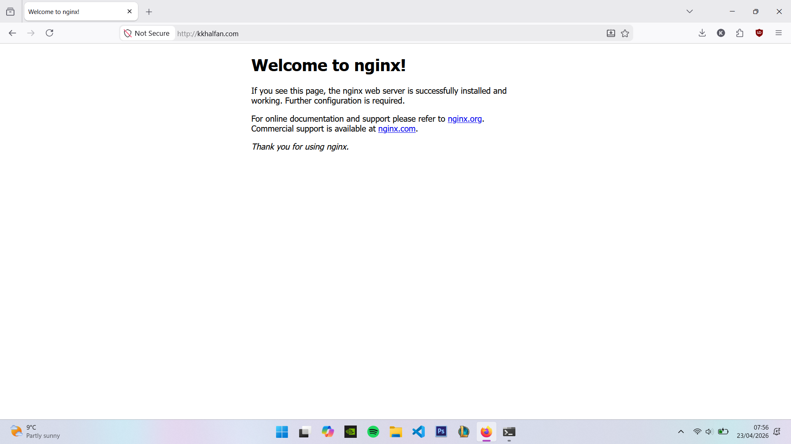
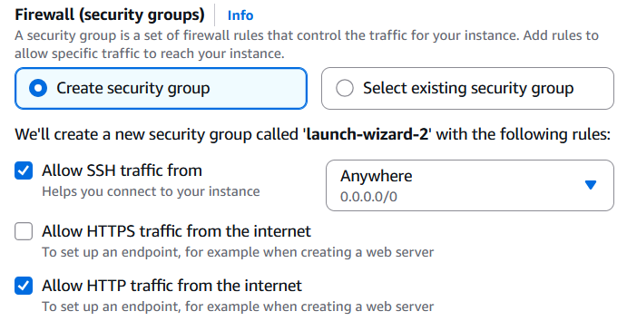
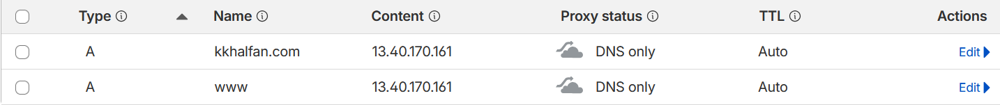

# EC2 + DNS Setup

To consolidate my learnings on IP's, routing, DNS, ports and basic hosting. I deployed NGINX on an EC2 instance and made the page load over a domain I bought.

The result can be seen on the image at the end of this document

This Image below is the result, once I connected my EC2 instance running NGINX to my domain.



The image shows the NGINX landing page when I load the domain `kkhalfan.com` , which signalled to me that I succeded in what I set out to do.


## Step 1: Buy a Domain

I bought the domain `kkhalfan.com` on Cloudflare, there are a few reasons I chose Cloudflare:

   - It is a Domain registrar and DNS hosting provider, this means as soon as I buy the domain it is ready to be used 
   - The free tier includes a lot of value compared to other services like Route 53
   - It provides wholesale price with no hidden costs, even for popular TLD's like .com

## Step 2: Launch an EC2 instance

1. I opened AWS Console then pressed launch instance
2. Then configured the instance with the settings I wanted. Ubuntu (due to familiarity) on a t3.micro (for cost-effectiveness). Generated key-pair in order to SSH.

    A key setting in this step is to configure the firewall settings of the instance to create a new security group and check the 'Allow HTTP traffic from the internet' option. Without this the port 80, which we are using to connect the domain and nginx, will not work.



3. Then launch the instance.

## Step 3: Installing Nginx

1. Now that the instance is launced, I needed to connect to the instance from my personal machine. This is done through SSH, before we can do this I needed to change the permissions of the key I generated to read-only.

    I did this by navigating to where I downloaded the `my_key.pem` file and then used the following command.

```
chmod 400 'my_key.pem'
```
2. Now I can SSH into the EC2 instance by using the command:

```
ssh -i my_key.pem instance-user-name@instance-public-dns-name
```
    The `instance-user-name@instance-public-dns-name` can be found in the instance manager.

3. Now I had succesfully connected to my EC2 instance, I installed NGINX using the following commands.
```
sudo apt update
sudo apt install nginx
```

    NGINX is now ruuning and listening on port 80 (http port). The next step is to point the DNS pof my domain to the EC2 instance.

## Step 4: DNS setup

1. So on the cloudflare dashboard, I navigated to the DNS records for my domain.
2. Then I added two A (address) records which pointed to the public IP of my EC2 instance. One record is for when somewone types `kkhalfan.com` (@ or root) and the other is when somewone types `www.kkhalfan.com`. Which ever one is typed the DNS resolver no knows to point it to the IP I sent.




## Result

This Image below is the result, once I connected my EC2 instance running NGINX to my domain.


The image shows the NGINX landing page when I load the domain `kkhalfan.com` , which signalled to me that I succeded in what I set out to do.


`
   

